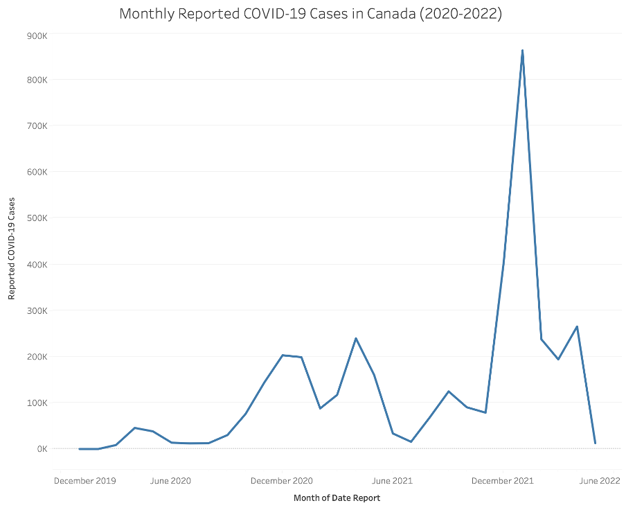
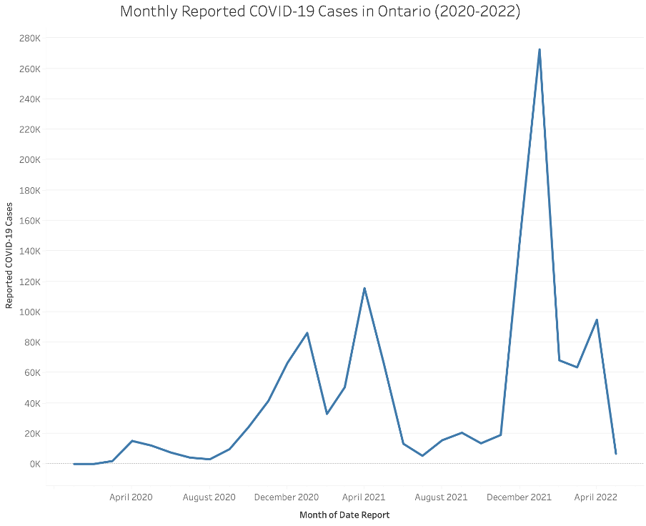
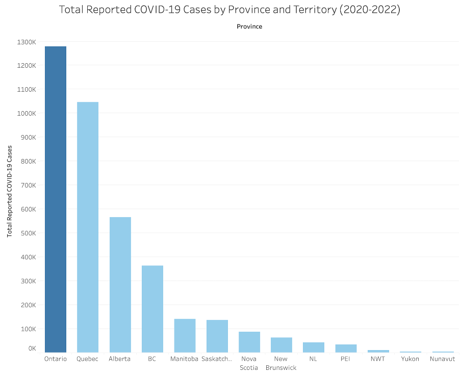

# Canada COVID-19 Tableau Analysis

Tableau analysis of reported COVID-19 case trends across Canada and Ontario from 2020 to 2022.

## Project Overview

This project examines reported COVID-19 case trends across Canada using Tableau. The analysis compares changes in monthly reported cases nationally and within Ontario, while also showing cumulative reported cases by province and territory.

The project demonstrates healthcare data visualization, trend analysis, data interpretation, and communication of public health findings to different audiences.

## Objectives

- Examine monthly trends in reported COVID-19 cases across Canada.
- Analyze monthly reported COVID-19 cases in Ontario.
- Compare total reported cases across provinces and territories.
- Identify periods of increased reported case activity.
- Communicate findings to policymakers, healthcare providers, and the general public.

## Dataset

| Item | Description |
|---|---|
| Dataset | `cases_timeseries_prov` |
| Source | McMaster University course materials |
| Time period | 2020–2022 |
| Geographic coverage | Canadian provinces and territories |
| Main measures | Reported COVID-19 case counts and report dates |

> The original dataset is not included in this repository because it was supplied through course materials.

## Tools Used

- Tableau
- Microsoft Word
- Healthcare data interpretation
- Data visualization

## Visualizations

### Monthly Reported COVID-19 Cases in Canada



### Monthly Reported COVID-19 Cases in Ontario



### Total Reported COVID-19 Cases by Province and Territory



## Analysis Process

1. Reviewed the structure and fields in the course dataset.
2. Connected the dataset to Tableau.
3. Grouped reported cases by month and geographic area.
4. Created two line charts to examine national and Ontario trends.
5. Created a bar chart to compare provinces and territories.
6. Interpreted the results for healthcare policymakers, healthcare providers, and the general public.
7. Summarized the analysis in a written report.

## Key Findings

- Reported COVID-19 cases in Canada fluctuated throughout the study period.
- Canada recorded its highest monthly total of **863,002 cases in January 2022**.
- Ontario recorded **3 reported cases in January 2020** and reached a peak of **272,560 cases in January 2022**.
- Ontario recorded the highest cumulative number of reported cases, followed by Quebec.
- Yukon recorded the fewest reported cases in the provincial and territorial comparison.

## Stakeholder Relevance

### Healthcare Policymakers

The visualizations can support healthcare resource allocation, emergency preparedness, targeted public health interventions, and identification of areas requiring additional monitoring.

### Healthcare Providers

The trends can help providers anticipate periods of increased demand, plan staffing, prepare isolation capacity, strengthen infection prevention measures, and maintain essential medical supplies.

### General Public

The visualizations provide an accessible view of how reported COVID-19 case activity changed over time and across Canada, supporting informed personal health decisions.

## Repository Structure

```text
canada-covid19-tableau-analysis/
├── docs/
│   ├── canada-covid19-tableau-analysis-report.docx
│   └── README.md
├── images/
│   ├── monthly-covid19-cases-canada-2020-2022.png
│   ├── monthly-covid19-cases-ontario-2020-2022.png
│   ├── total-covid19-cases-by-province-territory-2020-2022.png
│   └── README.md
├── tableau/
│   ├── canada-covid19-tableau-analysis.twb
│   └── README.md
└── README.md
```

## How to Review the Project

1. View the three visualizations directly in this README or in the `images` folder.
2. Open the report in `docs` to review the full stakeholder analysis.
3. Open the workbook in `tableau` using Tableau Desktop or Tableau Public.

## Skills Demonstrated

- Tableau chart development
- Healthcare data visualization
- Time-series analysis
- Geographic comparison
- Trend interpretation
- Stakeholder-focused communication
- Public health analytics
- Report writing

## Reference

McMaster University. (2026). *cases_timeseries_prov* [Data set]. Avenue to Learn.

## Project Status

Completed.
